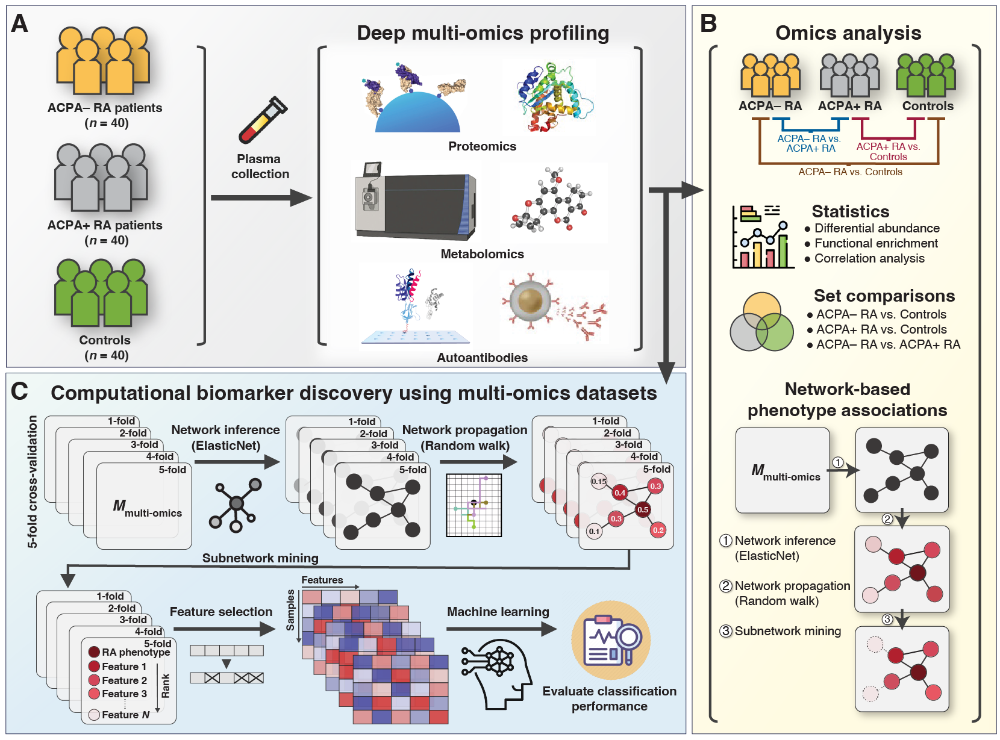

# Integrative Multi-Omics Phenotyping in Blood Reveals Distinct Immune and Metabolic Signatures between ACPA-negative and ACPA-positive Rheumatoid Arthritis

**DOI:** TBD

**Authors:** Benjamin Hur, Minsik Oh, Vinod K. Gupta, Kevin Y. Cunningham, Hu Zeng, Cynthia S. Crowson, Kenneth J. Warrington, Elena Myasoedova, Vanessa L. Kronzer, John M. Davis, and Jaeyun Sung

## Overview



### [1] Deep plasma multi-omic profiling

Utilized to create a dataset comprising 7,273proteins and 1,061metabolites from:
- 40 ACPA– RA patients
- 40 ACPA+ RA patients
- 40 healthy controls

### [2] Statistical analyses and set comparisons

Performed to characterize and differentiate the three study cohorts at the single- and multi-omic levels. A multi-omic network that elucidates associations between various omic features and clinical attributes, including study group (or phenotype), was constructed using penalized (elastic net) linear regression.

### [3] Feature selection scheme for phenotype classification

Composed of three main steps:
1. **Multi-omic Network Construction:** Nodes represent omic features, and edges symbolize links between features inferred using elastic net linear regression.
2. **Network Topology Propagation via Random Walker Algorithm:** Initiated from a seed node representing the clinical phenotype (i.e., ACPA– RA, ACPA+ RA, or controls), this process aims to identify omic features most closely connected to phenotypes on the network topology.
3. **Evaluation in 5-fold Cross-validation:** A random forest classifier was trained on the identified omic features to evaluate their potential for phenotype classification.

## Omics Data Preprocess

> **NOTE:** Preprocessed files are stored in "preprocessed_data_public". Please rename "preprocessed_data_public" to "preprocessed_data" if you wish to reproduce the study results.

### 1. Preprocess: proteomics data from Somascan's delivered File (.adat)

- `src/preprocess/proteomics/PREPROCESS_somascan_raw_data_STEP1.ipynb`
- `src/preprocess/proteomics/PREPROCESS_somascan_raw_data_STEP2.ipynb`

Designed to:
1. Remove non-human proteins.
2. Address duplicated proteins.
3. Unify sample IDs for multi-omics comparison.

### 2. Preprocess: metabolomics data from Metabolon's delivered File (DATA TABLE.XLSX, Batch-normalized Data)

- `src/preprocess/metabolomics/01_PREPROCESS_metabolon_raw_data_STEP1.ipynb`
- `src/preprocess/metabolomics/02_PREPROCESS_metabolon_raw_data_STEP2.ipynb`
- `src/preprocess/metabolomics/03_PREPROCESS_metabolon_raw_data_STEP3.ipynb`

Designed to:
1. Remove metabolites with >20% N/A values (across all samples).
2. Normalize metabolites to median 1.
3. Impute missing values with the metabolite's minimum value.
4. Unify sample IDs for multi-omics comparison.

### 3. Preprocess: merging multi-omics matrices and patient information into a single matrix

- `src/preprocess/multiomics/PREPROCESS_make_2_omics_matrix.py.ipynb`

Designed to:
1. Merge preprocessed proteomics, metabolomics, autoantibody, and patient information data into a single matrix.
2. Handle feature names that Rscript cannot process.

## Statistics

### 1. Organize demographics and perform statistics for clinical variables (Manuscript Table 1)

- `src/statistics/patient_info/summarize_demographics_for_table1.ipynb`
- `src/statistics/patient_info/table1_statistics.ipynb`

Designed to:
1. Use input data from: `preprocessed_data/meta/patient_info_for_statistics.tsv`, `preprocessed_data/meta/patient_info_for_statistics.v3.tsv`.
2. Apply Fisher's Exact Test and Kruskal-Wallis rank sum test for statistics.

### 2. Create a ternary plot to compare properties of the profiled plasma multi-omics data (Manuscript Fig. 2)

- `src/statistics/ternary_plots/STEP01_PREPROCESS_Ternary_Plot.ipynb`
- `src/statistics/ternary_plots/STEP02_Ternary_Plot.ipynb`

Designed to:
1. Create a ternary plot for proteomics and metabolomics profiles.
2. Store results at: `analysis/statistics/ternary_plots/`.

### 3. Create scatter plot of correlations between clinical markers and omics features (Manuscript Fig. 2)

- `src/statistics/omics_clinical_feature_correlation/PREPROCESS_make_omics_correlation_matrix.ipynb`
- `src/statistics/omics_clinical_feature_correlation/draw_scatterplots_for_figure2.R.ipynb`

Designed to:
1. Create scatter plots of correlations between clinical variables (e.g., ESR) and omics features.
2. Visualize the correlations of ACPA– RA ~ clinical variables, and ACPA+ RA ~ clinical variables in scatter plot.
3. Store results at: `analysis/statistics/omics_clinical_feature_correlation/`.

### 4. Linear regression & Cohen's D to identify phenotype-associated proteins/metabolites (Manuscript Fig. 3-4)

- `src/statistics/linear_model_logit/01_DifferentialAbundance_and_cohens_D_adjust_effect_v2.ipynb`
- `src/statistics/linear_model_logit/02_report_differential_abundance_adjusting_drug.ipynb`
- `src/statistics/volcano_plots/MAKE_volcano_plot_Rscript.ipynb`

Designed to:
1. Perform logistic regression models while adjusting for various factors.
2. Obtain effect size using Cohen's D.
3. Visualize identified features using volcano plots.


## Machine Learning

### 1. Create 5-fold dataset

- `analysis/5fold_data/network_construction_enet/01_preprocess_omics_enet.sh`
- `analysis/5fold_data_ra_only/network_construction_enet/01_preprocess_omics_enet.sh`

Designed to: split datasets into balanced 5-fold datasets.

```
The shell script utilizes
>src/network_construction_5fold/enet_construction_preprocess.py
>src/acpa_specific_network_construction_5fold/enet_construction_preprocess.py
```

### 2. Infer a network from 5-fold dataset using elastic net (Part 1)

For each K-fold dataset, perform elastic net to infer network from the data.
Due to running time, I've splitted the data into several batches and runned via cluster.

- `analysis/5fold_data/network_construction_enet/02_create_omics_enet.*.sh`
- `analysis/5fold_data_ra_only/network_construction_enet/02_create_omics_enet.*.sh`

**NOTE:** Elastic net results are stored in:
- [5fold_data_results](TBD)
- [5fold_data_ra_only_results](TBD)
- Please use these files for down-stream analysis if you wish to reproduce the study results.

```
The shell script utilizes
>src/network_construction_5fold/enet_construction_batch*.py
>src/network_construction_5fold_ra_only/enet_construction_batch*.py

enet_construction_batch*.py utilizes
>src/src/network_construction_5fold/ElasticNet_R.short.r
>src/src/network_construction_5fold_ra_only/ElasticNet_R.short.r
```

### 3. Infer a network from 5-fold dataset using elastic net (Part 2)

#### 3.1 Make adjacent matrix into topology (source-target).

- `analysis/post_network_enet/5fold/enet_3condition/01_organize_topology_files.sh`
- `analysis/post_network_enet_ra_only/5fold/enet_3condition/01_organize_topology_files.sh`


**NOTE:** RWR results are stored in:
- [5fold_data_RWR_results: TBD](https://drive.google.com/drive/folders/140W1aTweCnttRaEUKgpsrA6Z3Y_T_8Do)
- [5fold_data_ra_only_RWR_results: TBD](https://drive.google.com/drive/folders/1JZhhVDHIZlCwRGMzJgUdu5MOFoak1STc)
- RWR results were performed with the output from elastic net results provided in the step mentioned above.

```
The shell script utilizes
>src/post_network/integrate_network.v2.py
```

#### 3.2 RWR script (from R) has problem understanding some strings. This scripts tries to avoid those issues.
- `analysis/post_network_enet/5fold/enet_3condition/02_preprocess_RWR.sh`
- `analysis/post_network_enet_ra_only/5fold/enet_3condition/02_preprocess_RWR.sh`

```
The shell script utilizes
>src/post_network/cleanup_RWR_ready_file.py
```

#### 3.3  Prepare for RWR 'seed' list.

- `analysis/post_network_enet/5fold/enet_3condition/03_make_RWR_p0.sh`
- `analysis/post_network_enet_ra_only/5fold/enet_3condition/03_make_RWR_p0.sh`

```
The shell script utlizes
>src/post_network/RWR_create_seed_profile.py
```

#### 3.4 Run RWR

- `analysis/post_network_enet/5fold/enet_2condition/04_run_RWR.sh`
- `analysis/post_network_enet_ra_only/5fold/enet_2condition/04_run_RWR.sh`

```
The shell script utlizes
>src/post_network/RWR.R
```

### 4. Perform Machine Learning

#### 4.1 Prepare matrices for machine learning with features selected by elasticnet and RWR cutoff thresholds.

Results are stored in `Table S23.xlsx` in the manuscript.

- `analysis/machine_learning/5fold_v2/enet_2condition/01_create_feature_selected_matrix.sh`
- `analysis/machine_learning/5fold_v2/enet_2condition/02_create_feature_selected_matrix.v2.sh`
- `analysis/machine_learning_ra_only/enet_2condition/01_create_feature_selected_matrix.sh`
- `analysis/machine_learning_ra_only/enet_2condition/02_create_feature_selected_matrix.v2.sh`

```
01_create_feature_selected_matrix.sh is for applying RWR cutoffs via percentage (e.g., top1%, top 5%)
01_create_feature_selected_matrix.v2.sh is for applying RWR cutoffs via top N (e.g., top10, top 20)

The shell script utlizes
>src/machine_learning/create_feature_selection_matrix.py
```

Prepare the data for two-class classification. For example, if the machine-learning task is for ACPA-negative vs. control, discard ACPA-positive class samples from the data.

Perform machine-learning with feature-seleted matrices. I highly recommend to read "run.sh" before performing ML.

- `analysis/machine_learning/5fold_v2/enet_2condition/03_3class_to_2class.sh`
- `analysis/machine_learning/5fold_v2/enet_2condition/05_3class_to_2class.sh`
- `analysis/machine_learning/5fold_v2/run.sh`
- `analysis/machine_learning_ra_only/enet_2condition/03_3class_to_2class.sh`
- `analysis/machine_learning_ra_only/run.sh`

```
The shell script ultilzes
>src/machine_learning/transform_3class_to_2class_matrix.py
>src/machine_learning/classification_5fold.2class.opti.withMCC.py
```

## Misc

### 1. Addressing Reviewer Comments

Not available at the moment.

### 2. Metabolomics Hypergeometric Tests

- `src/statistics/geneset_enrichment/metabolomics/STEP01_PREPROCESS_make_updownDEG.ipynb`
- `src/statistics/geneset_enrichment/metabolomics/STEP02_PREPROCESS_hypergeometric_test_for_metabolomics.ipynb`
- `src/statistics/geneset_enrichment/metabolomics/STEP03_hypergeomteric_test_for_metabolites.ipynb`
- `src/statistics/geneset_enrichment/metabolomics/STEP04_prepare_bubble_plot_format_V2.ipynb`
- `src/statistics/geneset_enrichment/metabolomics/STEP05_draw_bubble_plot_V2.ipynb`

Designed to identify enriched biochemical pathways. Results are stored in `analysis/statistics/gse/metabolomics`.

### 3. Network Inference and RWR with Full Data (Fig 5)

**NOTE:** Elastic net results for 'full_data' are stored in: [full_data_results TBD](TBD)

- `analysis/full_data/create_omics_enet.sh`
- `analysis/full_data/post_network_enet/01_organize_topology_files.sh`
- `analysis/full_data/post_network_enet/02_preprocess_RWR.sh`
- `analysis/full_data/post_network_enet/03_make_RWR_p0.sh`
- `analysis/full_data/post_network_enet/04_run_RWR.sh`
- `analysis/full_data/cytoscape/01_make_cytoscape_ready_from_full_topology.sh`
- `analysis/full_data/cytoscape/02_subnetwork_from_full_topology.sh`

Designed to infer the network on full data and perform RWR.

```
Shell script utilizes:
src/network_construction_5fold/ElasticNet_R.short.fulldata.r
src/post_network/integrate_network.v2.py
src/post_network/cleanup_RWR_ready_file.py
src/post_network/RWR_create_seed_profile.py
src/post_network/RWR.R
src/network_visualization/make_cytoscape_ready_file.py
src/network_visualization/find_subnetwork_from_cyto_file.v2.py
```

### Package/Library versions (which may affect differences in results)

Python packages were last tested with:

**networkx**: 3.3
**scikit-learn**: 1.4.2
**scipy**: 1.13.0

R packages were last tested with:

**lme4**: 1.1-35.1
**dplyr**: 1.1.4
**effects**: 4.2-2
**stringr**: 1.5.1  
**lmerTest**: 3.1-3
**Matrix**: 1.5-4.1 
**effsize**: 0.8.1 
**diffusr**: 0.1.4 (https://github.com/dirmeier/diffusr)
